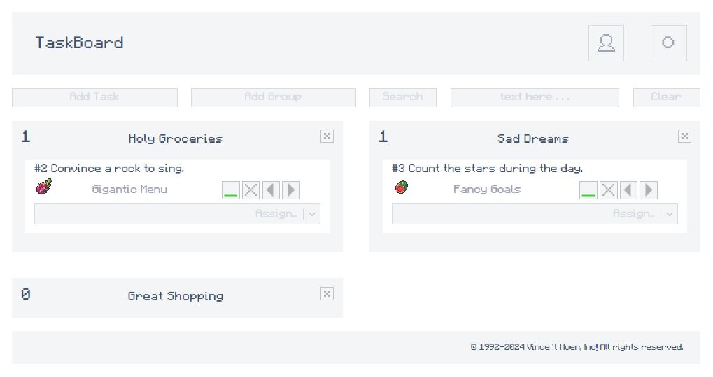
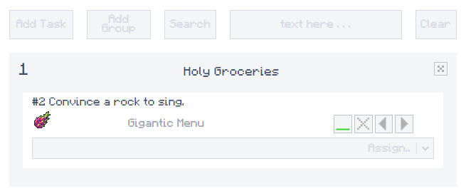
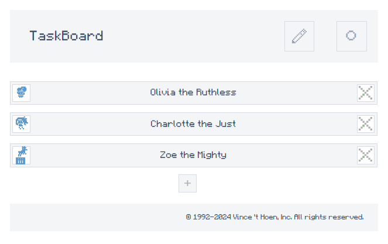
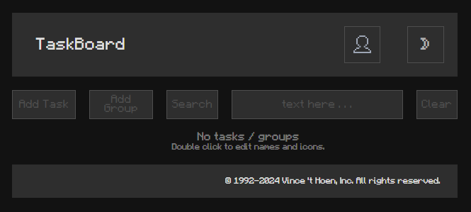

# TaskBoard Application

TaskBoard is a web application designed to help you manage your tasks efficiently. It allows you to quickly add, search, and organize tasks into groups, providing a clear overview of your projects. With features like local storage and dark mode, the app is designed to be flexible, accessible, and user-friendly.



---
## Features

- **Add Task**: Quickly add new tasks to your task board.
- **Add Group**: Organize tasks into groups for better management.
- **Add and Assign People**: Choose names and icons for people, and assign them to tasks.
- **Edit Logos and Texts**: Double-click on logos and texts to edit them.
- **Search Task**: Easily find tasks using the search functionality.
- **Clear Search**: Reset the search term to view all tasks again.
- **Dark Mode**: Toggle dark mode for a more comfortable viewing experience in low light.
- **Local Storage**: All tasks, groups, and people are saved locally using a custom hook (`useLocalStorage`), allowing persistence between sessions.
- **Random Generation**: Quickly generate random names, icons, and group names for tasks and groups to speed up creation.
---

## How to Use

### Adding a Task

1. Locate the "Add Task" input box at the top of the page.
2. Enter the name of the task you wish to add.
3. Press "Enter" or click on the "Add Task" button to add the task to the board.

### Searching for a Task

1. Use the search bar labeled "Search" at the top of the page.
2. Enter the text you want to search for.
3. Press "Enter" or click on the "Search" button to find tasks that match your search term.

### Task Overview

- Each task is displayed with an icon and name for easy identification.
- Tasks can be moved between groups using the left and right arrows next to each task.



---

## People Management

### Adding and Assigning People to Tasks

1. Click on the "Assign" button next to the task you want to assign a person to.
2. A dialog will appear where you can choose an existing person or create a new one by selecting a name and an icon.
3. Assign the person to the task by confirming your choice.



---
## UI Overview

- **Header**: Contains the TaskBoard title, Darkmode button and the button to switch between People and Note page.
- **Body** input boxes for adding tasks and groups, and the search input and clear button buttons. Underneath you will find the notes and groups it self.
And of course on the people page there is a list of the people you added and an add button underneath.
- **Footer**: Displays the copyright information.



---

## Technical Details

### Components

- **TaskBoard**: The main component that renders the task board.
- **TaskGroup**: A component that represents a group of tasks.
- **Task**: A component that represents an individual task.
- **SearchTask**: A component that handles the search functionality.

### Context

- **TaskFunctionsContext**: Provides task-related functions to components..
### Hooks Overview

- **`useState`**: Manages component-level state, such as tasks, dark mode, and UI updates.
- **`useEffect`**: Handles side effects, like saving tasks to localStorage or updating the UI on certain state changes.
- **`useContext`**: Accesses shared data or functions across components using `TaskFunctionsContext`.
- **`useMemo`**: Optimizes performance by memoizing values or calculations that depend on state or props.
- **`useCallback`**: Prevents unnecessary re-renders by memoizing callback functions, especially for event handlers.
- **`useAutoAnimate`**: Automatically animates elements during state changes for smooth transitions in the UI.
- **`useLocalStorage`** (custom hook): A custom hook to manage state that persists in the browser's `localStorage`.
  
### Additional Libraries

- **`BrowserRouter`** (from `react-router-dom`): Handles routing within the application, enabling navigation between different views and components.


- ** **

---

## Development

To contribute to the development of this application, follow these steps:

1. Clone the repository.

   ```bash
   git clone /* add new repo link.. */


2. Install dependencies.

    ```bash
    npm install

3. Start the development server.

    ```bash
    npm run dev
---